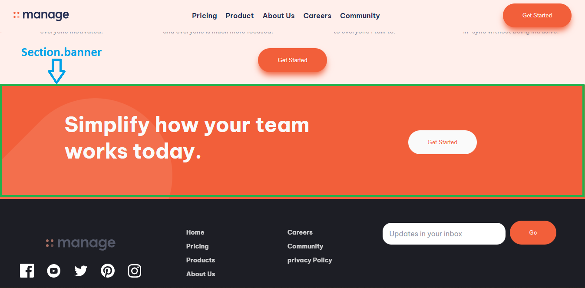

# Frontend Mentor - Manage landing page solution

This is a solution to the [Manage landing page challenge on Frontend Mentor](https://www.frontendmentor.io/challenges/manage-landing-page-SLXqC6P5). Frontend Mentor challenges help you improve your coding skills by building realistic projects.

## Table of contents

-   [Overview](#overview)

-   [The challenge](#the-challenge)

-   [Screenshot](#screenshot)

-   [Links](#links)

-   [My process](#my-process)

-   [Built with](#built-with)

-   [What I learned](#what-i-learned)

-   [Useful resources](#useful-resources)

-   [Author](#author)

## Overview

### The challenge

Users should be able to:

-   View the optimal layout for the site depending on their device's screen size
-   See hover states for all interactive elements on the page
-   See all testimonials in a horizontal slider
-   Receive an error message when the newsletter sign up `form` is submitted if:
-   The `input` field is empty
-   The email address is not formatted correctly

### Screenshot


### Links

-   Solution URL: [GitHub](https://github.com/MarcosRubi/Manage-landing-page)
-   Live Site URL: [GitHub Pages](https://marcosrubi.github.io/Manage-landing-page/)

## My process

### Built with

-   Semantic HTML5 markup
-   CSS custom properties
-   Flexbox
-   Mobile-first workflow
-   [React](https://reactjs.org/) - JS library

### What I learned

This is my second project made using React and I have learned how to use:

-   [useRef](https://www.w3schools.com/react/react_useref.asp)
-   [JS Observer API with React](https://appatico.com/detectar-elemento-con-intersection-observer-en-react/)

HTML:

```html
<section className="{`banner`}" ref="{bannerRef}"></section>
```



JS:
```js
const bannerRef = useRef(null);
const [visible, setVisible] = useState("");
const [entryObserver, setEntryObserver] = useState(false);

useEffect(() => {
    const observer = new IntersectionObserver(
        (entries) => {
            const entry = entries[0];
            setEntryObserver(entry.isIntersecting);
            if (entryObserver) {
                setVisible("visible");
            }
        },
        {
            root: null,
            rootMargin: "0px",
            threshold: 0.3,
        }
    );

    observer.observe(bannerRef.current);
}, [entryObserver]);
```

CSS:
```css
.banner {
    opacity: 0;
}
.banner.visible {
    opacity: 1;
    animation: visible 1s linear;
}
```

When the section enters 30% of the viewport with the observer API, it adds the "visible" class that performs the animation in css and changes the opacity to 1

### Useful resources

-   [Header Sticky in React](https://stackoverflow.com/questions/62970456/how-to-create-sticky-headers-on-scroll-with-react) - This helped me to make a sticky menu.

-   [Observer in React](https://appatico.com/detectar-elemento-con-intersection-observer-en-react/) - This helped me to be able to add classes to the sections when they entered the viewport.

## Author

-   Website - [Marcos Rubí](https://mrubi.vercel.app/)

-   Frontend Mentor - [@MarcosRubi](https://www.frontendmentor.io/profile/MarcosRubi)
